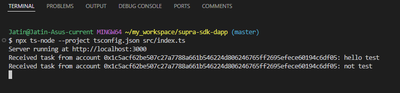

# Supra SDK Starkey Dapp
This Project Demonstrates How to Integrate the Supra SDK and StarKey wallet into a Simple to-do list application built with React and TypeScript.

## Introduction
This project is a dapp that allows users to add and manage tasks. The tasks are sent to a backend server using the Supra SDK, which interacts with the Supra blockchain. Users can connect their StarKey wallet to the dapp to interact with the application securely.

## Setup and Installation

### Prerequisites
Node.js and npm installed on your system

### Installation
- Clone the repository:

```bash
git clone https://github.com/JatinSupra/supra-sdk-dapp.git
cd supra-sdk-dapp
```

- Install dependencies for the frontend:

```bash
cd frontend
npm install
```

- Install dependencies for the backend:

```bash
cd ..
npm install
```

### Running the Backend:

```bash
npx ts-node --project tsconfig.json src/index.ts
```

**Example output:**




### Running the Frontend:

```bash
cd frontend
npm start
```

**Example output:**


### Access the DApp:
Open your browser and navigate to `http://localhost:3001`

## Using Supra SDK
The Supra SDK is used in this project to interact with the Supra blockchain. It allows the backend server to initialize a Supra client and handle transactions.

### Key Functions
`SupraClient.init:` Initializes a Supra client to connect to the Supra blockchain.

`SupraClient.addTask:` Sends a task to the Supra blockchain.

## Using StarKey Wallet
The StarKey wallet is integrated into the dapp to allow users to connect their wallet and interact with the application securely.

### Key Functions
`window.starkey.supra.connect:` Connects the user's StarKey wallet.

`window.starkey.supra.sendTransaction:` Sends transactions from the user's wallet.

## Important Components
`App.tsx`
The main component of the application. It sets up the layout and renders the WalletConnection and TodoList components.

`index.tsx`
The entry point of the React application. It renders the App component into the DOM.

`TodoList.tsx`
The component responsible for displaying and managing the to-do list. It handles adding and deleting tasks and communicates with the backend server.

`wallet.ts`
Defines utility functions for interacting with the StarKey wallet, including connecting the wallet and handling transactions.

`WalletConnection.tsx`
The component responsible for connecting the user's StarKey wallet and setting the account state in the App component.

`index.ts`
The backend server entry point. It initializes the Supra client and defines API endpoints for interacting with the Supra blockchain.

## Contributing
Feel free to open issues and submit pull requests for improvements and new features.